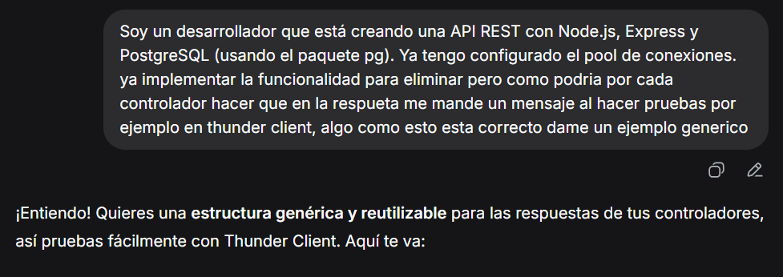
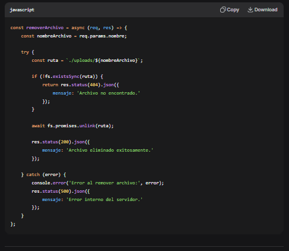

Para usar el proyecto se requiere tener instalado postgresSQL 18.
A futuro añadire un backup de la db, pero como ahora acabamos de recibir feedback
recien lo tome en cuenta.
asi que por ahora se debe crear una db en pg admin con el combre de: proyectoWeb

pense a futuro en la db asi que añadi la tabla de usarios pero nada de autenticaciones, 
solamente añadir y eliminar usuarios, debido a este pense en el diseño de db con cada usuario
puede tener varias notas y una nota NO puede tener varios usuarios, es asi que
siguiendo esa logica NO se pueden ver todas las notas de la db que hay, sino todas las notas que
tiene 1 usuario en especifico, o una nota en especifico.
los id se crean con cascade por eso es automatico. Yo use thunder client para probar y ejecuta el server 
llamado backend con el comando: npm run dev
rutas a probar:
Registrar usuario (esto es solo para futuro, lo puse porque tuve tiempo) :
POST: 
http://localhost:3000/api/auth/registrar
Body:
{
    "username": "carlos",
    "password": "123456"
}

Crear nota:
POST: 
http://localhost:3000/api/notas
Body:
{
    "titulo": "Comprar víveres",
    "detalle": "Leche, pan, huevos",
    "hora": "10:00",
    "fecha": "2024-06-15"
}

//aqui aplico la logica de mi diseño de la db
ver todas las notas de un usuario:
GET:
http://localhost:3000/api/notas/usuario/(id USUARIO)

editar una nota: 
PUT:
http://localhost:3000/api/notas/(id de la nota)
{
    "titulo": "Comprar víveres urgente",
    "detalle": "Leche, pan, huevos y mantequilla :D"
}

ver la nota especifica (esto lo cree solo para hacer la prueba)
GET: 
http://localhost:3000/api/notas/(ID de la nota)

cambiar estado para marcar si esta hecho o no:
PATCH:
http://localhost:3000/api/notas/(id de la nota)/estado

eliminar nota:
DELETE:
http://localhost:3000/api/notas/(id de la nota)

eliminar usurio:
DELETE:
http://localhost:3000/api/auth/eliminar-cuenta/7

Entender que es una api rest;
https://www.youtube.com/watch?v=8-Mv5ih5hTE

Video para implementar postgresql en node js:
https://www.youtube.com/watch?v=KMXo8lnkM9Y

Video de como usar Thunder client:
https://www.youtube.com/watch?v=HZx5X3s_Jl4

Tutorial de rest api con expres.js del canal fazt:
explicacion tecnica
https://www.youtube.com/watch?v=wMwON-gwyVM

Implente de aqui como configuar el .env y la estructura de carpetas:
https://www.youtube.com/watch?v=ArdQcI2X1cc

para averiguar codigos de estado de respuesta HTTP:
https://developer.mozilla.org/es/docs/Web/HTTP/Reference/Status

Luego aqui use la ia DeepSeek porque queria añadir un mensaje aparte de solo el status: 

como puede observar la ia lo hizo sin sql, yo me apegue mas la tutorial de fazt usando SQL, 
lo use para averiguar mensajitos y no solo error 201 por ejemplo, ademas en un contexto diferente
