# Mi Proyecto Web

El proyecto corre en localhost con https el tutorial de despliegue del proyecto se encuentra al final
primero se mostrara toda la informacion y fuentes que se usaron en el proyecto.

## Diseño de la Base de Datos

Para el sistema de usaurios:
* Añadir usuarios.
* Eliminar usuarios.
* Iniciar sesion

Debido a esto pensé el diseño de la base de datos bajo la siguiente lógica:
* Un usuario puede tener varias notas.
* Una nota NO puede pertenecer a varios usuarios.

Siguiendo esa lógica:
* No se pueden ver todas las notas de la base de datos.
* Se pueden ver todas las notas que pertenecen a un usuario específico.
* Se puede consultar una nota específica.

## Backend

Yo usé Thunder Client para realizar las pruebas y para las pruebas del drive se uso postman.
Ejecuta el servidor backend con:
npm run dev

## Rutas para Probar

### Autenticación

### Registrar usuario
**POST**
http://localhost:4000/api/auth/registrar
Body
{
    "username": "carlos",
    "password": "123456"
}

### Iniciar sesión
**POST**
https://localhost:4000/api/auth/login
Body
{
    "username": "carlos",
    "password": "123456"
}

### Eliminar cuenta
**DELETE**
https://localhost:4000/api/auth/eliminar-cuenta
Header
Authorization: Bearer (token)

---

### Notas
Todas requieren Header: Authorization: Bearer (token)

### Ver todas mis notas
**GET**
https://localhost:4000/api/notas/usuario

### Ver todas mis notas con paginación
**GET**
https://localhost:4000/api/notas/usuario?pagina=1&limite=2

### Ver una nota específica
**GET**
https://localhost:4000/api/notas/(id de la nota)

### Crear nota
**POST**
https://localhost:4000/api/notas
Body
{
    "titulo": "Comprar víveres",
    "detalle": "Leche, pan, huevos",
    "hora": "10:00",
    "fecha": "2024-06-15"
}

### Editar una nota
**PUT**
https://localhost:4000/api/notas/(id de la nota)
Body
{
    "titulo": "Comprar víveres urgente",
    "detalle": "Leche, pan, huevos y mantequilla :D"
}

### Cambiar estado de una nota
**PATCH**
https://localhost:4000/api/notas/(id de la nota)/estado

### Eliminar nota
**DELETE**
https://localhost:4000/api/notas/(id de la nota)

---

### Archivos
Todas requieren Header: Authorization: Bearer (token)

### Ver todos mis archivos
**GET**
https://localhost:4000/api/archivos

### Ver todos mis archivos con paginación
**GET**
https://localhost:4000/api/archivos?pagina=1&limite=12

### Subir archivo
**POST**
https://localhost:4000/api/archivos/subir
Body (form-data)
archivo: archivo.txt

### Actualizar nombre de un archivo
**PUT**
https://localhost:4000/api/archivos/(id del archivo)
Body
{
    "nombre": "nuevo_nombre.txt"
}

### Descargar archivo
**GET**
https://localhost:4000/api/archivos/descargar/(id del archivo)

### Eliminar archivo
**DELETE**
https://localhost:4000/api/archivos/(id del archivo)

# Referencias Utilizadas

## API REST

Entender qué es una API REST
importante para entender conceptos
https://www.youtube.com/watch?v=8-Mv5ih5hTE

PostgreSQL con Node.js
solo es necesario ver hasta la mitad
https://www.youtube.com/watch?v=KMXo8lnkM9Y

Thunder Client
video cortito de como usar
https://www.youtube.com/watch?v=HZx5X3s_Jl4

Tutorial REST API con Express.js (Fazt)
Explicación técnica y muy importante
https://www.youtube.com/watch?v=wMwON-gwyVM

Configuración de .env y estructura de carpetas
Implementé de aquí cómo configurar el `.env` y la estructura de carpetas, solo es necesario ver la mitad unos min
https://www.youtube.com/watch?v=ArdQcI2X1cc

Códigos de estado HTTP
Para averiguar códigos de estado de respuesta HTTP:
https://developer.mozilla.org/es/docs/Web/HTTP/Reference/Status

Como una guia general se utilizo el siguiente tutorial que usa todas las tecnologias que yo elegi:
sin bien no vi el tutorial completo si vi partes para el JSX y como empezar el backend.
Es una implemntacion de un to do list, mi proyecto final es muy diferente al del tutorial a continuacion:
https://www.youtube.com/watch?v=_zGL_MU29zs

## Uso de IA
Luego aquí usé la IA DeepSeek porque quería añadir un mensaje aparte de solo el status:

Como puede observar, la IA lo hizo sin SQL. Yo me apegué más al tutorial de Fazt usando SQL.
Lo usé para averiguar mensajes y no solamente devolver un código como 200, además de utilizarlo en un contexto diferente,
yo lo tengo mi version en la clase archivos controller.

Luego use aqui ia chatGPT para crear el servicio de subir archivos esto que debido a mi implementacion tenia errores y no funcionaba
tampoco encontre videos de youtube en español de este problema en especifico, yo lo tengo mi version adaptada en la clase 
archivos controller.
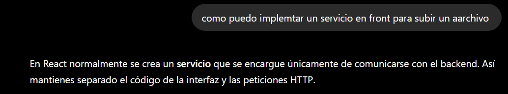
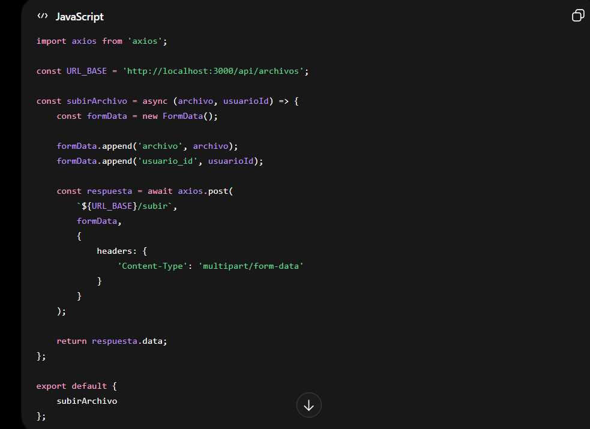
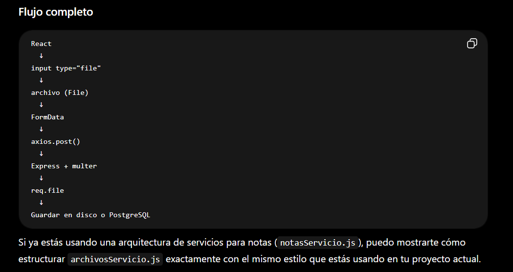

## Uso e-tag en el back

Aqui no pude encontrar material interactivo de como usar el E-tag manualmente asi que pregunte a la IA chatGPT:

Y me respondio con esto: 

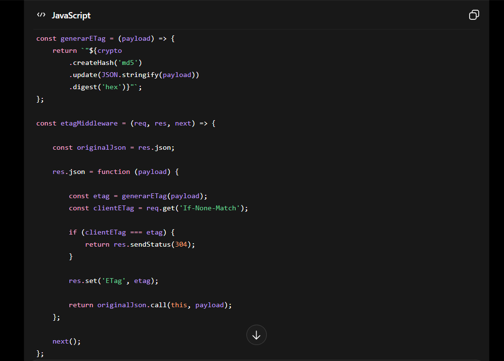

mi implementacion esta en etag.middleware.js backend\src\middlewares\etag.middleware.js
Quiero recalcar que he desactivado la opcion automatica de express para manejar el e-tag en la linea de codigo 11 de la clase
app.js del backend backend\src\app.js esto para que el e-tag solo tenga sentido en las rutas GET de archivos y notas osea listar
las notas sino express solo genera el e-tag automatico en los headers, como yo ya genero mi propio etag no es necesario
entonces lo desactive.

## Uso de e-tag en el front

Como ya mencione antes no encontre material para implementar etag en el proyecto,
asi que pregunte a la IA chatGPT con el mismo promt que mencione en la backend:

Y me respondio esto:

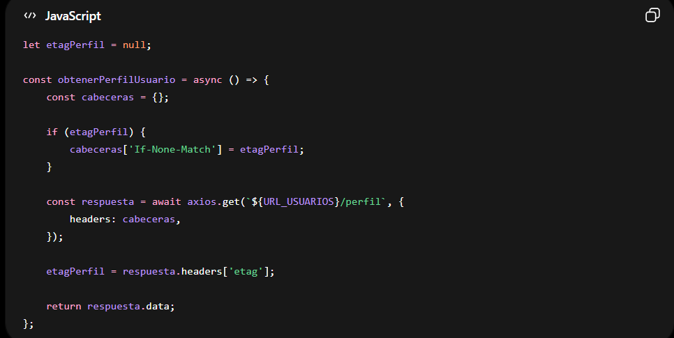

Mi implementacion esta en la clase:
archivosServicio.js :   frontend\src\servicios\archivosServicio.js
notasServicio.js :   frontend\src\servicios\notasServicio.js

# Parte del Drive

## Multer

El siguiente tutorial de mi youtuber favorito de programación, Fazt. Si bien él sube imágenes, yo lo utilicé para archivos y explica muy bien qué es Multer:
https://www.youtube.com/watch?v=AbJ-y2vZgBs

El siguiente tutorial explica qué es Multer con un ejemplo en código. Solo es necesario ver la primera parte, que es la única que vi:
http://youtube.com/watch?v=nRZE3It4B-E

El siguiente tutorial es el definitivo que usé y en el que me basé en su mayoría para realizar la implementación:
https://www.youtube.com/watch?v=2QYwRishObs

En este último tutorial se utilizó como referencia el siguiente repositorio para la arquitectura del file system:
https://github.com/JePaFeNet/crud-node.js/tree/v11-multer

Para la instalación de Multer y su configuración básica se utilizó el tutorial anterior. Sin embargo, los ejemplos de referencia utilizados provienen de la siguiente página:
https://www.digitalocean.com/community/tutorials/nodejs-uploading-files-multer-express

## Drive por Usuario
Para intentar implementar la idea de que cada usuario tenga su propio drive, me basé en el siguiente repositorio de GitHub que ya implementó esta funcionalidad usando file system, intente buscar en youtube y no encontre tutoriales relacionados:
Esta es la clase especifica que use toda la clase en general como referencia.
https://github.com/moahnaf11/File-Uploader/blob/main/controllers/folderController.js
Y mi propia implementacion corresponde a la clase archivos.controller.js en la direccion ..\backend\src\controllers\archivos.controller.js

## Inicio de sesion
Para saber el funcionamiento y implementacion de JWT el siguiente tutorial tambien se uso para react en el frontend:
https://youtu.be/zBbqrcvdJjQ?si=SFEtDnktYmzVptCG

Para la parte del middleware:
El repositorio aqui se uso a manera de ejemplo para la implementacion del middleware el repo es: 
https://github.com/bezkoder/node-js-express-login-example/blob/master/app/middleware/authJwt.js
Y mi propia implementacion corresponde a la clase auth.middleware.js en la direccion ..\backend\src\middlewares\auth.middleware.js

## File System
Se uso la ia copilot para ver como seria una implementacion de file system:
Yo adapte lo siguiente en la clase multer.js en la ubicacion backend\src\config\multer.js

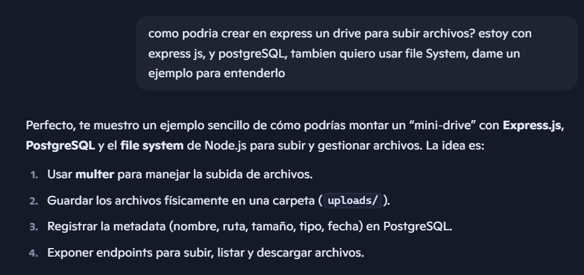

El ejemplo proporcionado yo lo adapte en la clase multer:
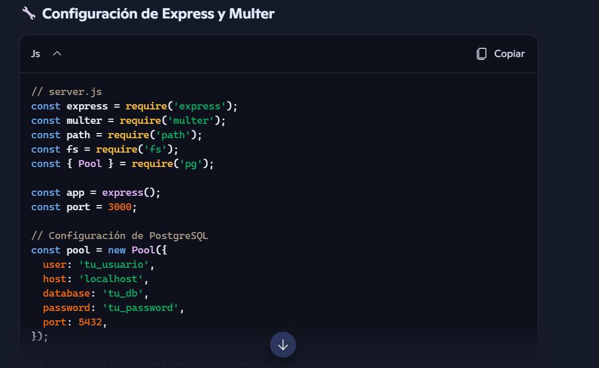
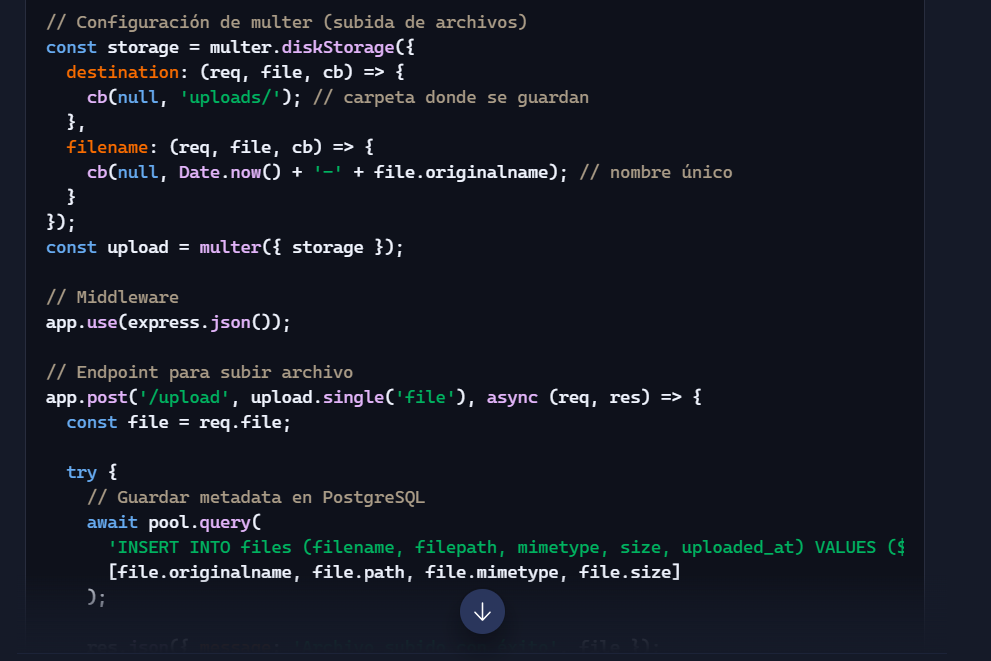
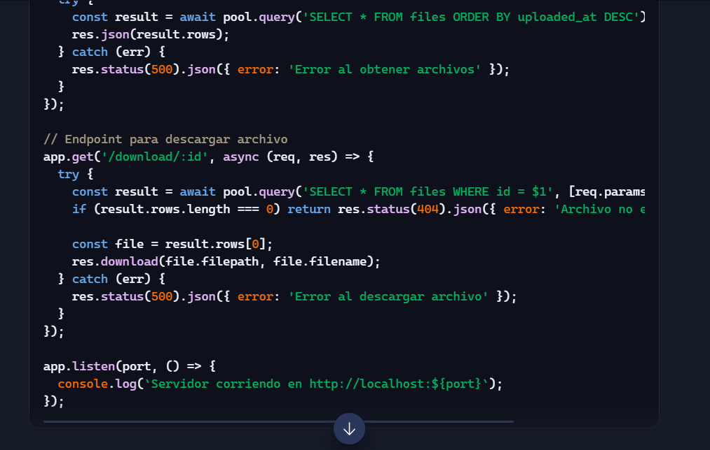

luego use la tabla de referencia
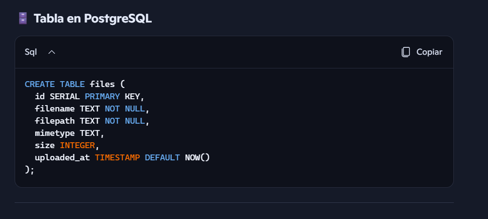

y finalmente me dijo;
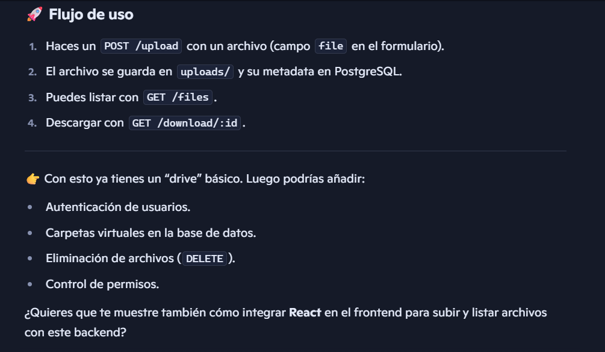

## Paginacion en el backend
Para la parte de paginacion en el back use de referencia el siguiente repositorio 
especificamente esta clase de aqui orders.controller.js:

https://github.com/dhatGuy/PERN-Store/blob/main/server/controllers/orders.controller.js

Y mi propia implementacion se encuentra en:
notas.controller en la funcion obtener notas: backend\src\controllers\notas.controller.js 
archivos.controller en la funcion obtener archivos: backend\src\controllers\archivos.controller.js

## Paginacion en el frontend
Para la parte de paginacion en el front use de referencia el siguiente repositorio 
especificamente esta clase de aqui api.js:

https://github.com/JHOAN-FIGUEROA/compuoriente/blob/83ba897e92f4dc1095e0014fb8017c4ccf2d4fd5/src/api.js#L132

Y mi propia implementacion se encuentra en:
notas.controller en la funcion de servicio de notas: frontend\src\servicios\notasServicio.js
archivos.controller en la funcion de servicio de archivos: frontend\src\servicios\archivosServicio.js

# Frontend

## Requisitos y Configuración Inicial

### Instalación de Node.js y npm

Sitio oficial:

https://nodejs.org/

### Crear proyecto React

npx create-react-app frontend
cd frontend
npm start

## React

Video introductorio de Código Facilito es un video cortito sencillo de entender
https://www.youtube.com/watch?v=rZ41y16Z5Ac

Documentación JSX solo se uso para partes muy puntuales
https://react.dev/learn/writing-markup-with-jsx

Tutorial JSX este tuto esta bien para lo basico, ver completo completo
https://www.youtube.com/watch?v=yJZx2q50s_g

## Axios

Tutorial Axios - Fazt Code
https://www.youtube.com/watch?v=VcJly0VxkXs

Documentación oficial
La saqué del video de Fazt que dije antes:
https://axios-http.com/es/docs/intro

## Estados (useState) y Efectos (useEffect)

Video Hooks en React
https://www.youtube.com/watch?v=LlvTdy9H4EA
el tutorial recomienda revisar lo siguiente yo lo revise muy basico
    Documentación useState
    https://react.dev/reference/react/useState
    Documentación useEffect
    https://react.dev/reference/react/useEffect

## Subida de archivos desde React

El repositorio aqui para hacer que se muestre desde react las funcionalidades del drive en backend, basandome aqui para hacer el componente:
https://github.com/bradtraversy/react_file_uploader/blob/master/client/src/components/FileUpload.js
Y mi propia implementacion corresponde a la clase Drive.js en la direccion ..\frontend\src\componentes\drive\Drive.js

## Inicio de sesion 

se uso el mismo tutorial del back que puse y era este
Para saber el funcionamiento y implementacion de JWT el siguiente tutorial tambien se uso para react en el frontend:
https://youtu.be/zBbqrcvdJjQ?si=SFEtDnktYmzVptCG

## Paginacion en el frontend

## Problema importante que tuve
Estaba fuera y necesité avanzar el proyecto desde otra computadora inicie sesión con mi cuenta de GitHub para poder trabajar sobre mi repositorio y subir los cambios hice varios commits desde esa máquina y después me di cuenta de que había un problema con las fechas registradas estaban aproximadamente poco menos 1 año atras. Más adelante intenté corregir el historial con un rebase falle colocando otra vez malas fechas ya que queria las que yo hice pero no funciono mas bien lo hice mal poniendo fechas equivocadas por culpa mia ya que nunca habia hecho un rebase ahi puse 25 de mayo que es antes del ultimo commit sin afectar que era viernes intente una segunda vez y si pude acomodar las fechas a una hora aproximada no exacta, sin embargo en mi activity aun se ven esos commits vacios que elimine de hace un año, pero puede verificar que esos 5 commits que se subieron hace casi año y se eliminaron son consistentes con la fecha y los aportes que continua el de dia viernes 29 de mayo, y yo trabaje estos comits el domingo 31 de mayo.

## Autocorrector
muchas veces se uso el auto corrector de visual studio code, para corregir errores de sintaxis

# Tutorial de instalación y ejecución para windows 11
Requisitos previos:
- Node.js v22.17.0 en: https://nodejs.org
- PostgreSQL 18 en: https://www.postgresql.org/download
(importante guardar la contraseña de postgres)
- pgAdmin (viene con la instalacion de postgres normalmente) pero si no lo tiene esta en: https://www.pgadmin.org/download
- mkcert v1.4.4 https://github.com/FiloSottile/mkcert/releases
- git version 2.51.0.windows.2: https://git-scm.com/downloads

## Clonar el repositorio
git clone https://github.com/MarsMirabalF/proyectoWeb
cd proyectoWeb

### Backup db
Para esto debe abrir PGAdmin
luego crearse una db con postgres 18

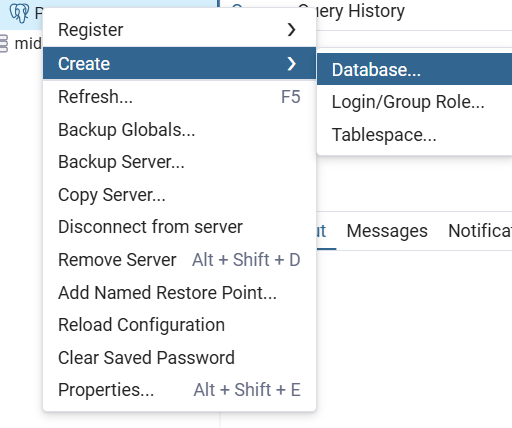

llamarla: "proyectoWeb" y darle a save, si ya tiene ese nombre puede cambiarlo, pero recuerde actualizar su
nombre en el .env del backend

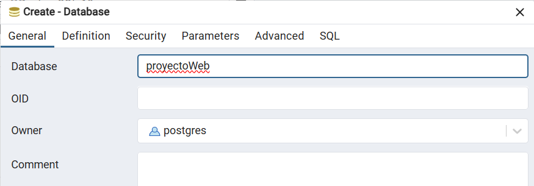

luego darle click derecho a la db creada y se abrira esto:

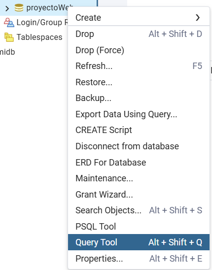

luego dar click derecho a la db creada y entrar a restore y desde ahi abrir el backupDB.sql 
en ..\proyectoFinal\backupDB.sql en como en la imagen:

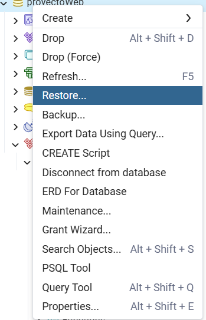

Debe de abrir y poner el archivo backupDB.sql en filename:

Tal vez no pueda ver el .sql para eso debe activar para ver los archivos .sql como en la imagen:

Habra el archivo y dele a abrir:

Luego debe deslizar hacia abajo dando click en role name para poner el siguiente usario:

Asi deberia quedar y dele a restore:

y eso seria todo.

El archivo backupDB.sql que subi al repo se genero automaticamente con la herramienta PGadmin
para facilitar todo.

Cabe recalcar que los archivos fisicos estan subidos al repositorio pero no estan en la db
por tanto este backupDB,sql ya tiene las direcciones del ultimo commit en el repositorio y
todo deberia funcionar bien.

## Instalar certificados HTTPS
Instala la autoridad certificadora en tu sistema, solo debe hacerse una vez:
mkcert -install

### Genera los certificados para el backend:
cd backend
mkcert -key-file key.pem -cert-file cert.pem localhost

### Genera los certificados para el frontend:
cd ../frontend
mkcert -key-file key.pem -cert-file cert.pem localhost

## Configurar el Backend
cd ../backend

### Instalar dependencias
npm install

## Crear el archivo `.env` en la carpeta backend
Crea un archivo llamado .env dentro de la carpeta backend y copia lo siguiente:
(ten en cuenta cambiar la contraseña con la que hayas creado postgres,
de JWT no es necesario cambiar nada).

PUERTO=4000
DB_USUARIO=postgres
DB_CONTRASENA=tu_contrasena_de_postgresql
DB_HOST=localhost
DB_PUERTO=5432
DB_NOMBRE=proyectoWeb
JWT_SECRETO=una_clave_secreta_muy_larga_y_dificil
JWT_EXPIRA_EN=8h

### Correr el backend
npm run dev

Se deberia ver algo asi al final de correr el backend:

Servidor HTTPS corriendo en https://localhost:4000
La base de datos esta funcionando por ahora todo nice :D

## Configurar el Frontend
Abre una nueva terminal y entra a la carpeta frontend:
cd proyectoFinal/frontend

### Instalar dependencias
npm install

## Crear el archivo `.env` en la carpeta frontend
Crea un archivo llamado .env dentro de la carpeta frontend y copia lo siguiente:
(no es necesario que cambies nada).

HTTPS=true
SSL_CRT_FILE=cert.pem
SSL_KEY_FILE=key.pem

### Correr el frontend
npm start

Se deberia ver algo asi al final de correr el frontend:

Compiled successfully!

You can now view frontend in the browser.

  Local:            https://localhost:3000
  On Your Network:  https://192.168.56.1:3000

Note that the development build is not optimized.
To create a production build, use npm run build.

webpack compiled successfully

## Iniciar sesión con los datos de prueba
La base de datos ya viene con varios usuarios de prueba aqui dejo algunos:
Usuario: vladimir  Contraseña: 123456     
Usuario: marcelo   Contraseña: 123456     