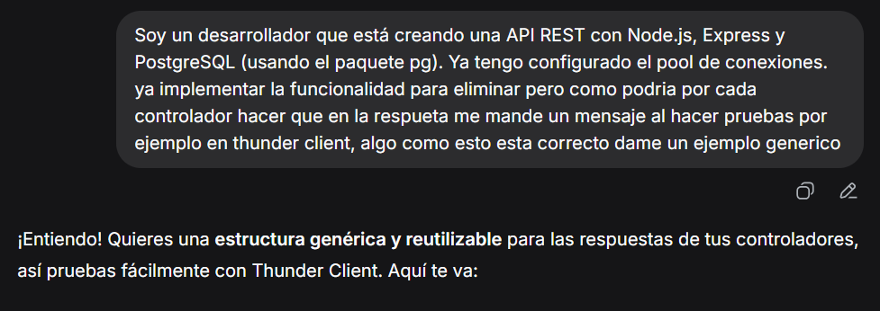
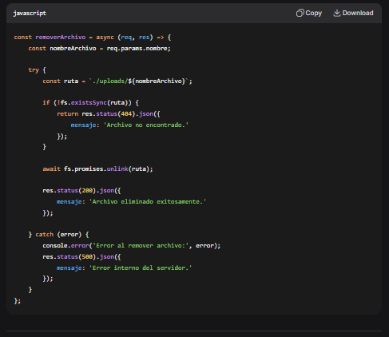

# Proyecto Web

## Requisitos Previos

Para usar el proyecto se requiere tener instalado PostgreSQL 18.

A futuro añadiré un backup de la base de datos, pero como acabamos de recibir feedback recién lo tomé en cuenta.

Por ahora se debe crear una base de datos en pgAdmin con el nombre:

proyectoWeb

## Diseño de la Base de Datos

Pensé a futuro en la base de datos, por eso añadí la tabla de usuarios, aunque todavía no existen autenticaciones completas.

Actualmente solamente se puede:

* Añadir usuarios.
* Eliminar usuarios.

Debido a esto pensé el diseño de la base de datos bajo la siguiente lógica:

* Un usuario puede tener varias notas.
* Una nota NO puede pertenecer a varios usuarios.

Siguiendo esa lógica:

* No se pueden ver todas las notas de la base de datos.
* Se pueden ver todas las notas que pertenecen a un usuario específico.
* Se puede consultar una nota específica.

Los IDs se crean automáticamente.

## Ejecución del Backend

Yo usé Thunder Client para realizar las pruebas y para las pruebas del drive se uso postman.

Ejecuta el servidor backend con:

npm run dev

## Rutas para Probar

### Registrar usuario
Esto es solo para futuro, lo puse porque tuve tiempo.
**POST**
http://localhost:4000/api/auth/registrar
Body
{
    "username": "carlos",
    "password": "123456"
}

### Crear nota
**POST**
http://localhost:4000/api/notas
Body
{
    "titulo": "Comprar víveres",
    "detalle": "Leche, pan, huevos",
    "hora": "10:00",
    "fecha": "2024-06-15"
}

### Ver todas las notas de un usuario
Aquí aplico la lógica del diseño de la base de datos.
**GET**
http://localhost:4000/api/notas/usuario/(id USUARIO)

### Editar una nota
**PUT**
http://localhost:4000/api/notas/(id de la nota)
Body
{
    "titulo": "Comprar víveres urgente",
    "detalle": "Leche, pan, huevos y mantequilla :D"
}

### Ver una nota específica
Esto lo creé solo para hacer la prueba.
**GET**
http://localhost:4000/api/notas/(ID de la nota)

### Cambiar estado de una nota
Permite marcar si está hecha o no.
**PATCH**
http://localhost:4000/api/notas/(id de la nota)/estado

### Eliminar nota
**DELETE**
http://localhost:4000/api/notas/(id de la nota)

### Eliminar usuario
**DELETE**
http://localhost:4000/api/auth/eliminar-cuenta/7

### Ver todos los archivos de un usuario
**GET**
http://localhost:4000/api/archivos/usuario/(id USUARIO)

### Subir archivo
**POST**
http://localhost:4000/api/archivos/subir/(id USUARIO)
**Body (form-data)**
archivo: seleccionar archivo

### Actualizar información de un archivo
**PUT**
http://localhost:4000/api/archivos/(id del archivo)

### Eliminar archivo
**DELETE**
http://localhost:4000/api/archivos/(id del archivo)

---

# Referencias Utilizadas

## API REST

### Entender qué es una API REST

https://www.youtube.com/watch?v=8-Mv5ih5hTE

### PostgreSQL con Node.js

https://www.youtube.com/watch?v=KMXo8lnkM9Y

### Thunder Client

https://www.youtube.com/watch?v=HZx5X3s_Jl4

### Tutorial REST API con Express.js (Fazt)

Explicación técnica:

https://www.youtube.com/watch?v=wMwON-gwyVM

### Configuración de .env y estructura de carpetas

Implementé de aquí cómo configurar el `.env` y la estructura de carpetas:

https://www.youtube.com/watch?v=ArdQcI2X1cc

### Códigos de estado HTTP

Para averiguar códigos de estado de respuesta HTTP:

https://developer.mozilla.org/es/docs/Web/HTTP/Reference/Status

## Uso de IA

Luego aquí usé la IA DeepSeek porque quería añadir un mensaje aparte de solo el status:

Como puede observar, la IA lo hizo sin SQL. Yo me apegué más al tutorial de Fazt usando SQL.

Lo usé para averiguar mensajes y no solamente devolver un código como 201, además de utilizarlo en un contexto diferente.

---

# Parte del Drive

## Multer

El siguiente tutorial de mi youtuber favorito de programación, Fazt. Si bien él sube imágenes, yo lo utilicé para archivos y explica muy bien qué es Multer:

https://www.youtube.com/watch?v=AbJ-y2vZgBs

El siguiente tutorial explica qué es Multer con un ejemplo en código. Solo es necesario ver la primera parte, que es la única que vi:

http://youtube.com/watch?v=nRZE3It4B-E

El siguiente tutorial es el definitivo que usé y en el que me basé en su mayoría para realizar la implementación:

https://www.youtube.com/watch?v=2QYwRishObs

En este último tutorial se utilizó como referencia el siguiente repositorio para la arquitectura del file system:

https://github.com/JePaFeNet/crud-node.js/tree/v11-multer

Para la instalación de Multer y su configuración básica se utilizó el tutorial anterior. Sin embargo, los ejemplos de referencia utilizados provienen de la siguiente página:

https://www.digitalocean.com/community/tutorials/nodejs-uploading-files-multer-express

## Drive por Usuario
Para intentar implementar la idea de que cada usuario tenga su propio drive, me basé en el siguiente repositorio de GitHub que ya implementó esta funcionalidad usando file system, intente buscar en youtube y no encontre tutoriales relacionados:
Esta es la clase especifica que use toda la clase en general como referencia.
https://github.com/moahnaf11/File-Uploader/blob/main/controllers/folderController.js
Y mi propia implementacion corresponde a la clase archivos.controller.js en la direccion ..\backend\src\controllers\archivos.controller.js

## Subida de archivos desde React
El repositorio aqui para hacer que se muestre desde react las funcionalidades del drive en backend, basandome aqui para hacer el componente:
https://github.com/bradtraversy/react_file_uploader/blob/master/client/src/components/FileUpload.js
Y mi propia implementacion corresponde a la clase Drive.js en la direccion ..\frontend\src\componentes\drive\Drive.js

---

# Frontend

## Requisitos y Configuración Inicial

### Instalación de Node.js y npm

Sitio oficial:

https://nodejs.org/

### Crear proyecto React

npx create-react-app frontend
cd frontend
npm start

---

## React

### Video introductorio de Código Facilito
https://www.youtube.com/watch?v=rZ41y16Z5Ac

### Documentación JSX
https://react.dev/learn/writing-markup-with-jsx

### Tutorial JSX (Video)
https://www.youtube.com/watch?v=yJZx2q50s_g

---

## Axios

### Documentación oficial
La saqué del video de Fazt:
https://axios-http.com/es/docs/intro

### Video Axios en React
https://www.youtube.com/watch?v=qM7QrAA-KTw

### Tutorial Axios - Fazt Code
https://www.youtube.com/watch?v=VcJly0VxkXs

## Estados (useState) y Efectos (useEffect)
### Documentación useState
https://react.dev/reference/react/useState

### Documentación useEffect
https://react.dev/reference/react/useEffect

### Video Hooks en React
https://www.youtube.com/watch?v=LlvTdy9H4EA

### Video useState y useEffect - Traversy Media
https://www.youtube.com/watch?v=O6P86IqJGFs
